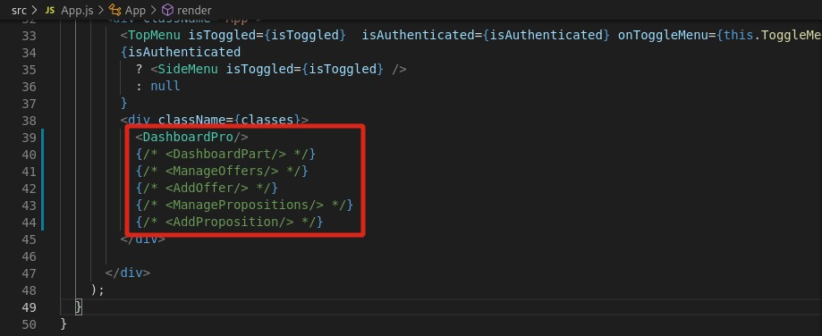

# Installing the project
node v12.21.0

npm v7.5.2

NOTE: different version ~ project not working for you

# Getting the project
On a terminal:

`git clone https://github.com/jibaromar/Mooqaf-FrontEnd.git`

# Starting the project
`cd Mooqaf-FrontEnd`

`npm start`

# Switching between views
On the file `src/app.js` uncomment only one component and leave the others commented

